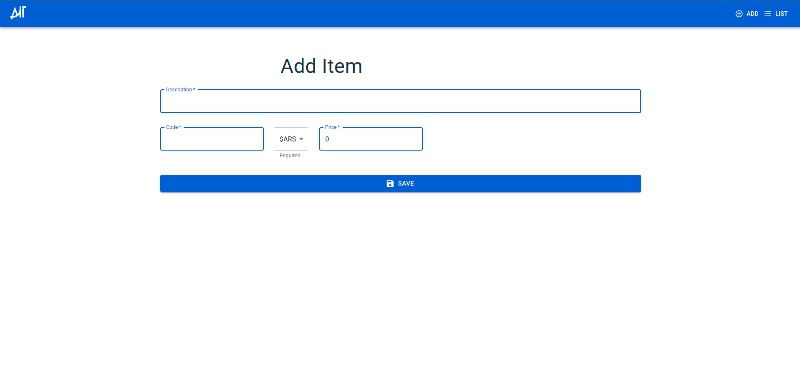
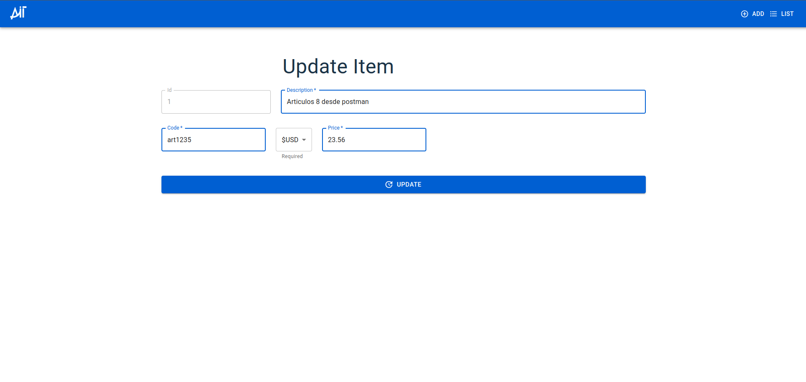
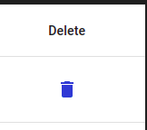

# prueba_tecnica_ait

Este es proyecto es una prueba tecnica para la empres Ait solutions.Contiene dos carpetas Front end y Back end.
En si es una aplicacion que muestra una listados de articulos y su agregado, modificado y borrado de ellos.
El front end esta hecho con lenguaje Reactjs -
El back end esta hecho con django y con una base de datos mysql.
python version 3.8-
sistema operativo linux Ubuntu 22.04.1 LTS


### Pre-requisitos 📋

_Necesitaras para el funcionamiento del proyecto Docker_
para mas informacion les dejo la documentacion de docker :https://docs.docker.com/desktop/install/linux-install/
Habre tu consola de linux.
```

sudo apt-get update
sudo apt-get install ca-certificates curl
sudo install -m 0755 -d /etc/apt/keyrings
sudo curl -fsSL https://download.docker.com/linux/ubuntu/gpg -o /etc/apt/keyrings/docker.asc
sudo chmod a+r /etc/apt/keyrings/docker.asc

# Add the repository to Apt sources:
echo \
  "deb [arch=$(dpkg --print-architecture) signed-by=/etc/apt/keyrings/docker.asc] https://download.docker.com/linux/ubuntu \
  $(. /etc/os-release && echo "$VERSION_CODENAME") stable" | \
  sudo tee /etc/apt/sources.list.d/docker.list > /dev/null
sudo apt-get update

sudo apt-get install docker-ce docker-ce-cli containerd.io docker-buildx-plugin docker-compose-plugin
```

_Revisar que los puertos 8000, 9000 y 3306 no esten ocupados_

```
sudo lsof -i:3306 
sudo lsof -i:8000 
sudo lsof -i:9000 
```

_En el caso que este ocupado lo puerto_

```
kill -9 PID
```

## Levantar localmente el proyecto ⚙️

_Para levantar el proyecto debes solo pararte en la ruta donde esta el docker-compose.yml_

abres tu consola 
Te paras en la carpeta principal del docker-ompose.yml
```
docker compose up
```
| CONTAINER ID  | IMAGE                        | COMMAND                   | CREATED         | STATUS        | PORTS                                                 | NAMES     |
|---------------|------------------------------|---------------------------|-----------------|---------------|-------------------------------------------------------|-----------|
| 52e927950795  | prueba_tecnica_ait-frontend  | docker-entrypoint.sh      | 7 seconds ago  | Up 6 seconds  | 0.0.0.0:8000->8000/tcp, :::8000->8000/tcp            | app_fe    |
|               |                              |                           |                 |               |                                                       |           |
| 051d571d5624  | prueba_tecnica_ait-backend   | sh -c 'python3 manage.py' | 24 minutes ago | Up 5 seconds  | 8000/tcp, 0.0.0.0:9000->9000/tcp, :::9000->9000/tcp | api_be    |
|               |                              |                           |                 |               |                                                       |           |
| b5bae3e3a8e1  | mysql:5.7                    | docker-entrypoint.sh      | 34 minutes ago | Up 6 seconds  | 0.0.0.0:3306->3306/tcp, :::3306->3306/tcp, 33060/tcp | db_mysql_dk|

### Analice las pruebas end-to-end 🔩

_Cuando este levantado eldocker le mostrara que la api de backend esta hosteado en localhost:9000_
_Que el front end esta hosteado en localhost:8000_

* Ingresar a localhost:8000
- Un pequeño inicio con un mensaje
* Tocar boton comenzar o list (arriba a la derecha)
 - Lista de articulos

* Para exportar, tocar el boton donde dice export . Al tocarlo se le descargara el archivo
- Archivo descargado
 -Un vistazo del archivo
* Para importar, debes tocar el boton import , se abrira la pantalla para buscar un archivo.
 -Archivo xlsx que debe respertar este formato y el nombre de las columnas-

 - Resultado

* Pantalla para insertar un articulo

* Pantalla para modificar un articulo

* Para borrar se debe clickear este icono


## Construido con 🛠️

* [Docker](https://docs.docker.com/manuals/) - Para el manejo de los contenedores
* [Python3.8](https://docs.python.org/3.8/) - Lenguaje para el back
* [Ddjango rest framework](https://www.django-rest-framework.org/) - Django framework
* [Reactjs](https://legacy.reactjs.org/docs/getting-started.html) - Usado para generar RSS
* [Vite](https://carlosazaustre.es/react-vite) - Usado para la compilación rapida de Reactjs
* [MUI](https://mui.com/material-ui/all-components/) - Usado para la seleccion de los componentes, esto me resulta mucho mas facil , por que tiene diseños predeterminados


## Autores ✒️

_Menciona a todos aquellos que ayudaron a levantar el proyecto desde sus inicios_

* **Facundo Argüello** - *Trabajo Inicial* - [facundoarguello](https://github.com/facundoarguello)
* **Andrés Villanueva** - *Plantilla de markdown* - [villanuevand](https://github.com/villanuevand)

## Expresiones de Gratitud 🎁

* Quiero agradecer a los chicos de Ait, por darme esta oportunidad. Es un reto que no es complicado pero te lleva tiempo y esfuerzo.📢

---
⌨️ con ❤️ por [Villanuevand](https://github.com/Villanuevand) 